<div align="center">

# cLaudeRC

**Run Claude Code from your phone.** Chat with every session, answer its questions,
see usage across your Claude accounts and get instant alerts. Your server, your key, no cloud service.

[](https://github.com/myGIGlife-claude/Claude-RC/actions/workflows/build.yml)
[](https://github.com/myGIGlife-claude/Claude-RC/releases/tag/latest-main)
-3DDC84?logo=android&logoColor=white)
-000000?logo=apple&logoColor=white)


[](LICENSE)

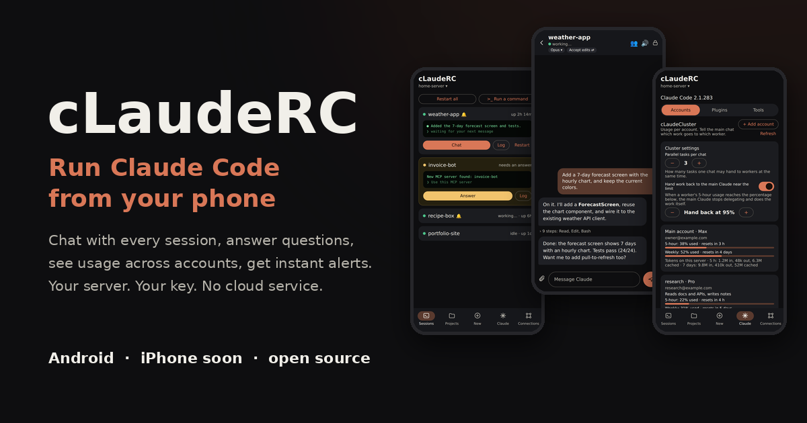

**[⬇ Download the Android APK](https://github.com/myGIGlife-claude/Claude-RC/releases/tag/latest-main)**
· [Quick start](#quick-start) · [Features](#features) · [Screenshots](#screenshots) · [cLaudeCluster](#claudecluster) · [iPhone](#iphone-app) · [Security](#security)

</div>

> All pictures here are illustrative mock-ups drawn with the app's own theme and made-up example data (projects, accounts and hosts are not real). Their source is in [docs/mockups](docs/mockups/).

## Contents

- [Quick start](#quick-start)
- [Features](#features): [Sessions and chat](#sessions-and-chat) · [Instant alerts](#instant-alerts) · [Projects](#projects) · [Several accounts](#several-accounts-as-a-team) · [Connections and keys](#connections-and-keys) · [Move to a new server](#move-to-a-new-server)
- [Screenshots](#screenshots)
- [How it works](#how-it-works) · [Screen reference](#screen-reference)
- [Install on the phone](#install-on-the-phone) · [Updates](#updates)
- [iPhone app](#iphone-app)
- [Security](#security) · [Building](#building) · [Contributing](#contributing) · [Share it](#share-it) · [License](#license-and-credit)

## Quick start

1. **On the server** (any Linux box with [Claude Code](https://claude.com/claude-code) signed in with a claude.ai subscription; `bash`, `curl`, `jq`, `tmux`, `git`, `flock`): nothing to install by hand, the app gives you one command.
2. **On the phone**: install the [latest APK](https://github.com/myGIGlife-claude/Claude-RC/releases/tag/latest-main) (Android 8.0+), open **cLaudeRC**, tap **Copy command**.
3. **Run that command** in a terminal on the server, enter Host / Port / Username in the app, compare the fingerprint and tap **Trust**. Done: your sessions are on your phone.

Full steps and what each part does are under [Install on the phone](#install-on-the-phone).

## Features

### Sessions and chat

<table>
<tr>
<td width="25%"></td>
<td width="25%"></td>
<td width="25%"></td>
<td>

- Every Claude Code session on your server, with **status lights** (idle, working, waiting for you) and its last lines.
- **Chat** inside the app behind a chat PIN: tool steps folded, Claude's questions as tappable options, **Stop**, model and permission-mode chips, 🔊 read-aloud, files Claude sends, 📎 to send files.
- A full-screen **log** with answer keys (1 2 3 ↑ ↓ y n Esc Enter) for anything the chat can't show.
- Safe **Restart** (reopens the same conversation), **Restart all**, Stop.

</td>
</tr>
</table>

### Instant alerts

<table>
<tr>
<td width="25%">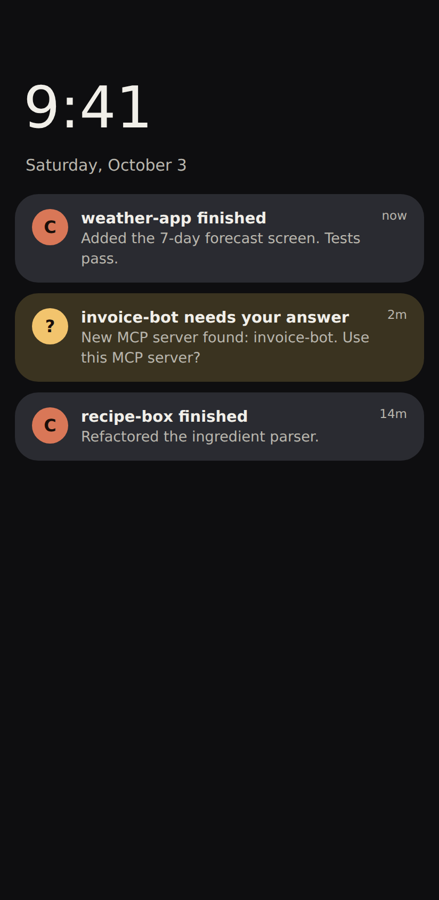</td>
<td width="25%">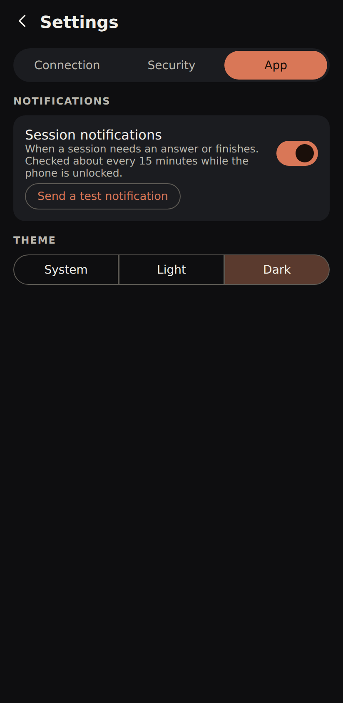</td>
<td>

- A **push alert the moment** a session needs an answer, and (with the 🔔 bell on that session) when it finishes. No 15-minute polling.
- Uses **your own free Firebase project**, so nothing is shared. In Firebase: *Project settings › Service accounts › Generate new private key*, then in the app *Settings › App › Notifications › Set up instant alerts* and paste the key. The server registers the app itself.
- *Send a test push* checks the whole chain. Restart your sessions once so Claude's hooks load.
- Not set up? The app falls back to checking about every 15 minutes while the phone is unlocked.

</td>
</tr>
</table>

### Projects

<table>
<tr>
<td width="25%"></td>
<td width="25%">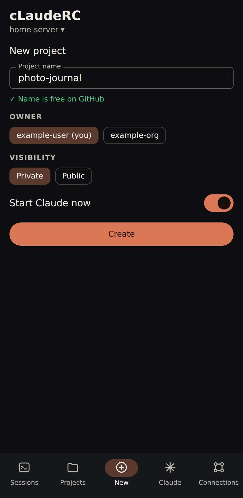</td>
<td>

- Your GitHub repos as tiles: **running**, **on server**, **GitHub only**, **archived**; search; open, clone or pull, start, stop, rename, make public or private, delete.
- **New project** creates the GitHub repo, clones it on the server and starts Claude in it, from one form.

</td>
</tr>
</table>

### Several accounts as a team

<table>
<tr>
<td width="25%">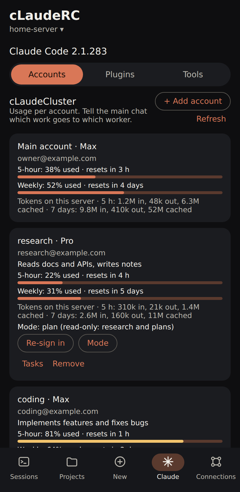</td>
<td width="25%">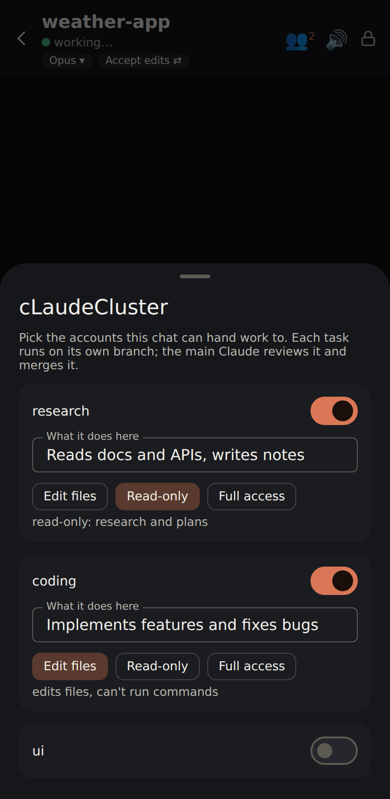</td>
<td width="25%">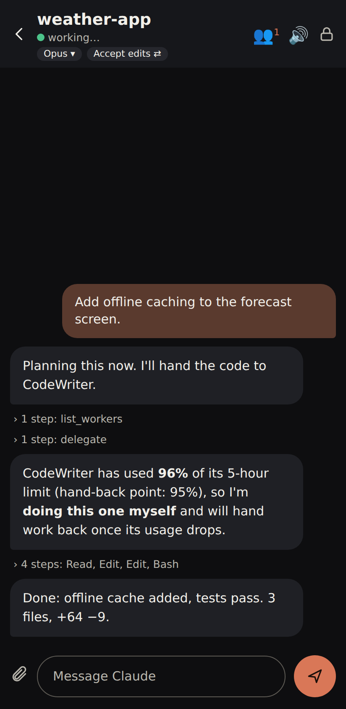</td>
<td>

- Connect **several Claude accounts**; see each one's **usage** (5-hour and weekly, filling with what is used) and tokens used on the server.
- The main Claude (research, planning, review on the big model) **hands code to workers**, one git branch per task, then reviews and merges.
- **Cluster settings** in the app: *parallel tasks per chat* (1 to 10) and *hand work back to the main Claude* at a usage level you choose (50 to 100%, default 95%).

Details and rules to give your sessions: [cLaudeCluster](#claudecluster).

</td>
</tr>
</table>

### Connections and keys

<table>
<tr>
<td width="25%">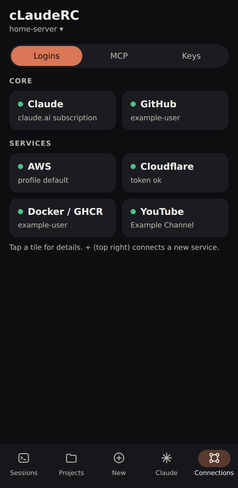</td>
<td width="25%"></td>
<td width="25%">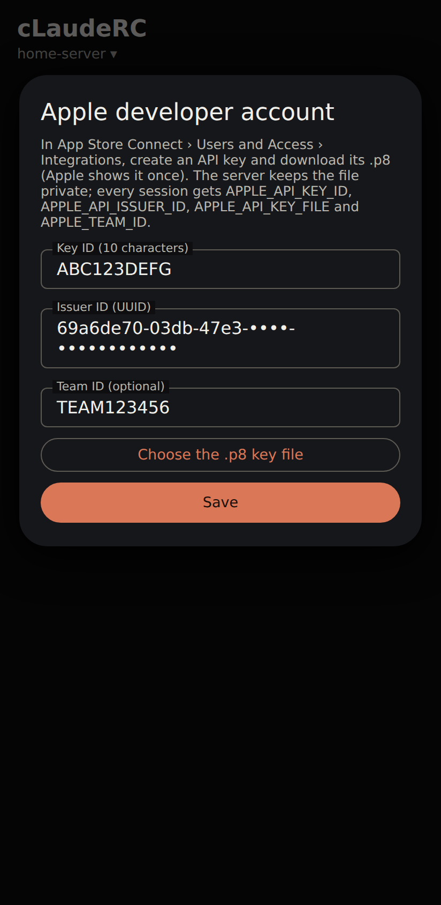</td>
<td>

- Everything your server is signed in to, as tiles with a live status: Claude, GitHub, AWS, GitLab, Docker/GHCR, YouTube, Cloudflare, Vercel, Supabase, Stripe, Firebase and more, plus **MCP servers** found automatically.
- **Keys**: Android signing keys, an **Apple developer account** (App Store Connect key for iOS builds), and any custom API key. Values are never shown; every Claude session gets them as environment variables.

</td>
</tr>
</table>

### Move to a new server

<table>
<tr>
<td width="25%">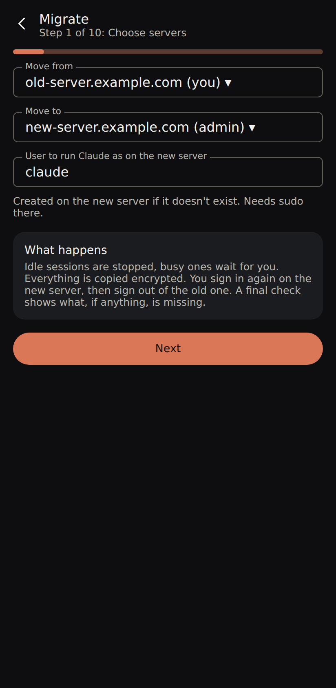</td>
<td width="25%">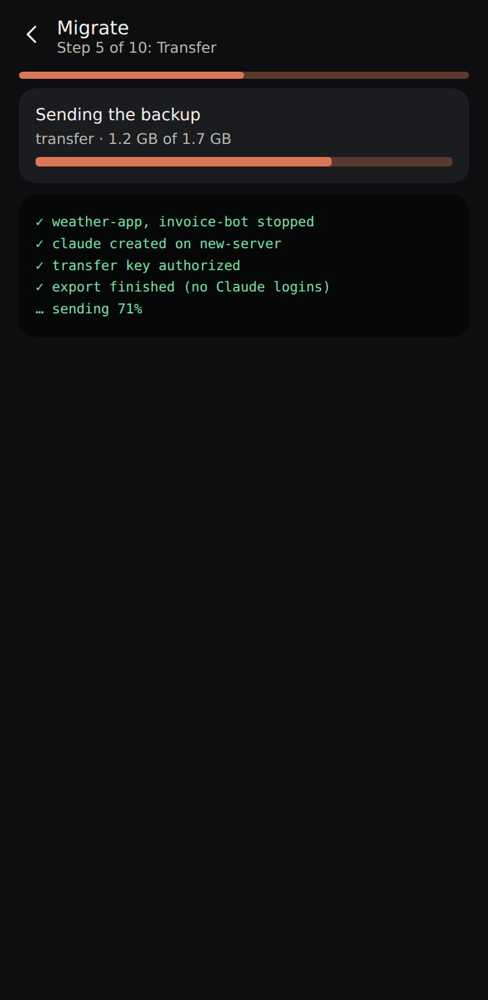</td>
<td width="25%">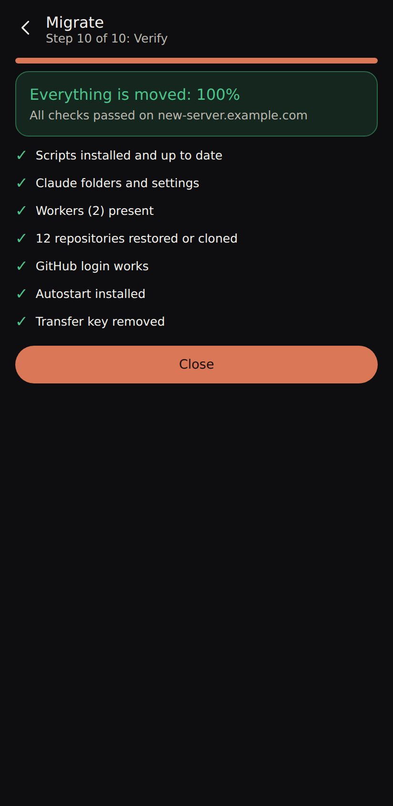</td>
<td>

- **Settings › Connection › Migrate** moves everything from one server to another, from the phone: pick the old and the new server (both already in the app) and the user to run Claude as, which is created on the new server if it doesn't exist.
- Sessions on the old server are checked first: idle ones are stopped, busy ones wait for your decision.
- Everything is sent encrypted straight between the servers (logins, keys, chat history, scripts, plus a rescue copy of project work that exists nowhere else; clean repos are cloned again). The Claude accounts are **not** copied: you sign in again on the new server, then sign out of the old one.
- Optional reboot, then a final check that lists exactly what is missing, or says everything is moved.
- Needs `ALLOW_RUN=1` on both servers (the same switch as *Run a command*, set on the server so a lost phone can't turn it on). Without the app you can do the same from a terminal: [docs/migration.md](docs/migration.md) and `claude-backup`.

</td>
</tr>
</table>

Also: **servers** (add as many as you like, they all use this phone's key), **plugins** (install, enable, update), **Run a command** (opt-in terminal, behind App lock), and an **app lock** with fingerprint or screen lock.

## Screenshots

<table>
<tr>
<td></td>
<td></td>
<td></td>
<td></td>
</tr>
<tr><td align="center">Sessions</td><td align="center">Chat</td><td align="center">Chat: 👥 workers</td><td align="center">Hand-back to main</td></tr>
<tr>
<td></td>
<td>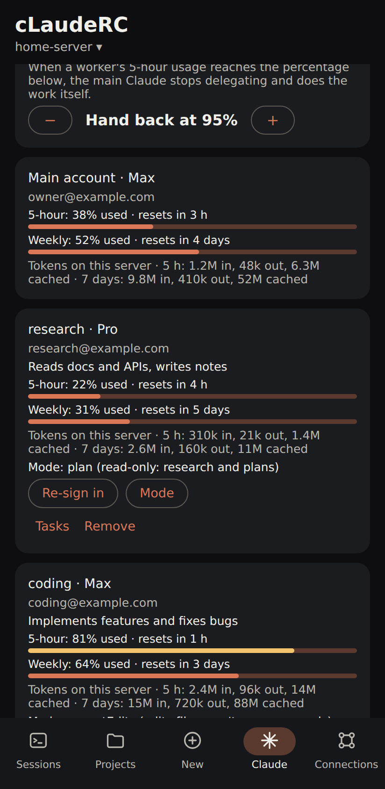</td>
<td>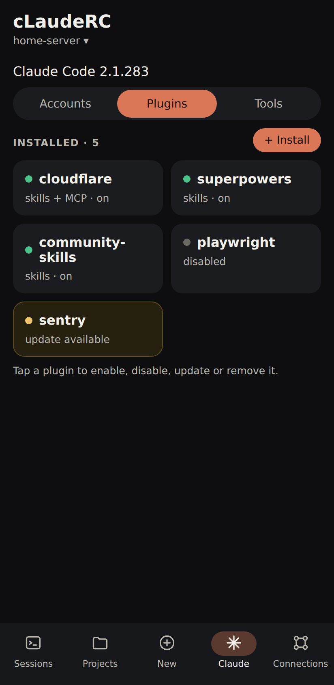</td>
<td>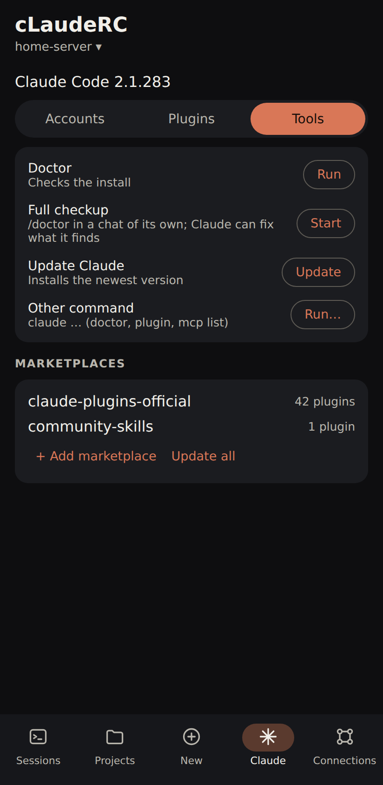</td>
</tr>
<tr><td align="center">Accounts + settings</td><td align="center">Accounts, scrolled</td><td align="center">Plugins</td><td align="center">Tools</td></tr>
<tr>
<td></td>
<td>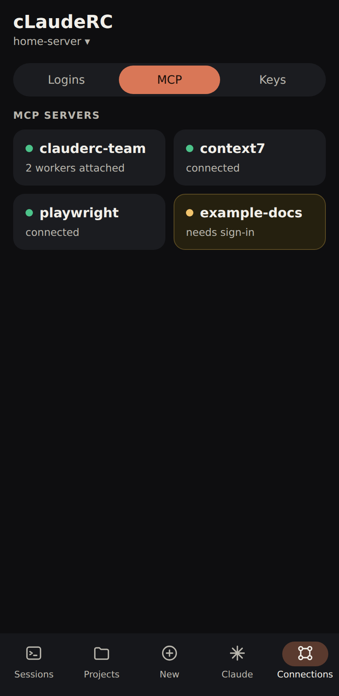</td>
<td>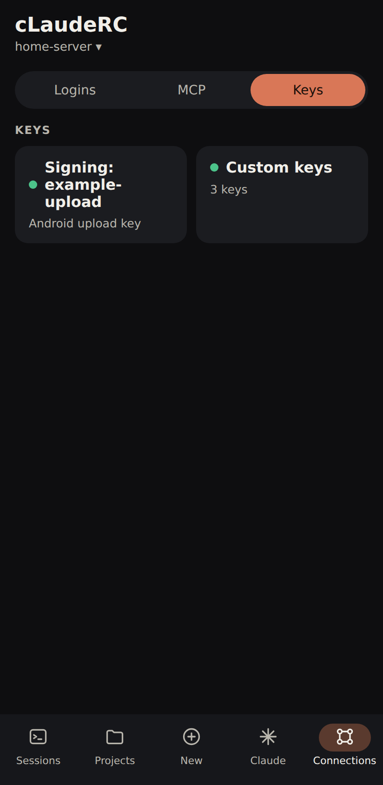</td>
<td></td>
</tr>
<tr><td align="center">Logins</td><td align="center">MCP</td><td align="center">Keys</td><td align="center">Apple developer account</td></tr>
<tr>
<td></td>
<td></td>
<td></td>
<td></td>
</tr>
<tr><td align="center">Projects</td><td align="center">New project</td><td align="center">Session log</td><td align="center">Instant alerts</td></tr>
</table>

<details>
<summary><b>More screens</b> (settings, dialogs, iPhone)</summary>

<table>
<tr>
<td>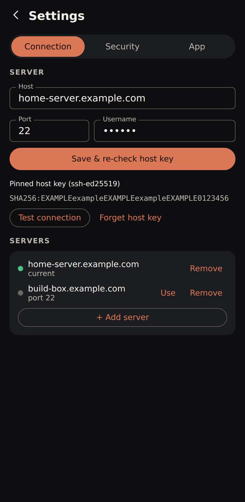</td>
<td>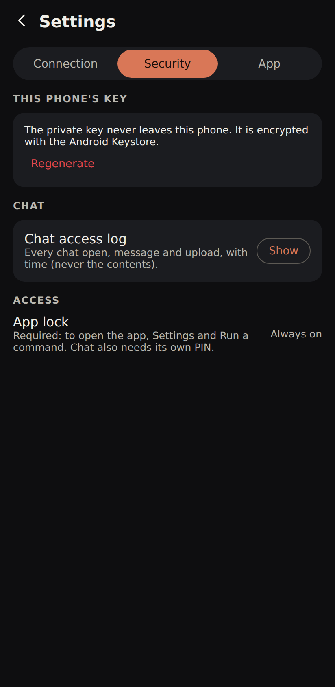</td>
<td></td>
<td></td>
</tr>
<tr><td align="center">Settings: Connection</td><td align="center">Settings: Security</td><td align="center">Settings: App</td><td align="center">+ Connect a service</td></tr>
<tr>
<td></td>
<td></td>
<td></td>
<td></td>
</tr>
<tr><td align="center">Details</td><td align="center">Install a plugin</td><td align="center">Run a command</td><td align="center">Chat PIN</td></tr>
<tr>
<td>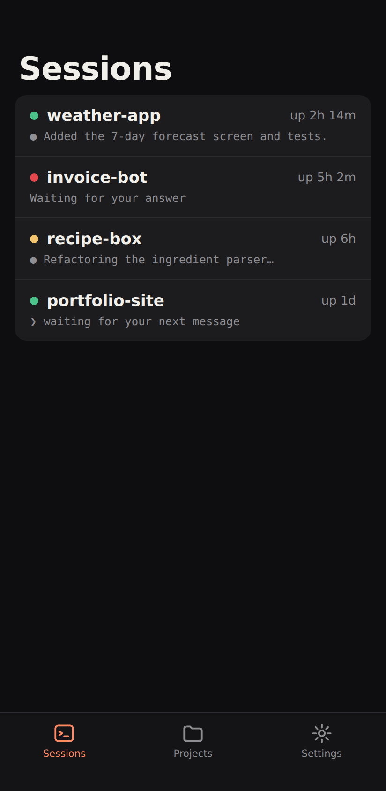</td>
<td>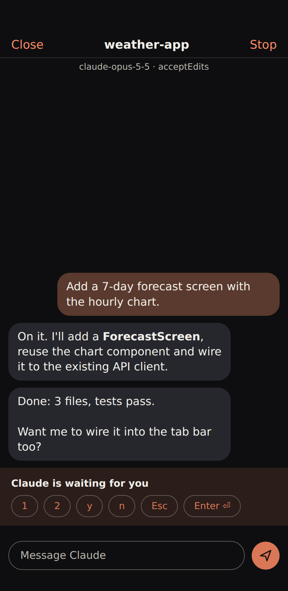</td>
<td>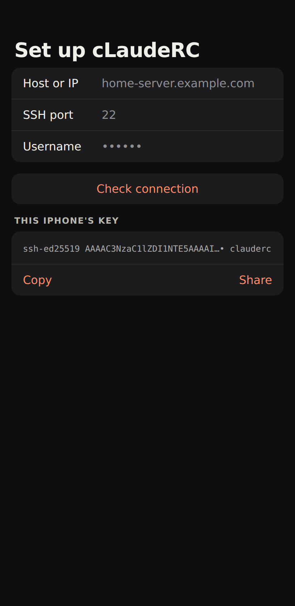</td>
<td></td>
</tr>
<tr><td align="center">iPhone: Sessions</td><td align="center">iPhone: Chat</td><td align="center">iPhone: Set up</td><td></td></tr>
</table>

</details>

<p align="center">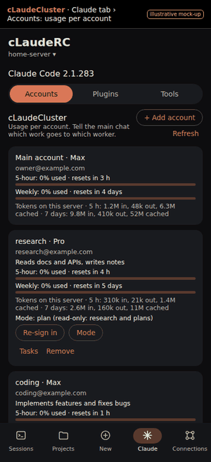</p>

## How it works

```
phone app ──SSH (its own Ed25519 key)──▶ sshd ──forced command──▶ claude-launcher-api
                                                                      │ allowlist + validation
                                                                      ▼
                                                     claude-setup.sh --api <action>  → one JSON object
```

Every call is short: connect, run one allowlisted action, read the JSON,
disconnect. The phone key can't open a shell, forward ports or run anything
off the allowlist (except **Run a command**, which is off unless you turn it on;
see [Security](#security)). There is no web server, open port or cloud service.
The only outside piece is optional: Firebase, for instant alerts, in a project you own.

- **Android app** (`app/`): Kotlin + Jetpack Compose, package `life.mygig.clauderc`.
- **iPhone app** (`ios/`): SwiftUI, see [iPhone app](#iphone-app).
- **Server** (`server/`): `claude-setup.sh` (menu + `--api` JSON mode), the
  forced-command runner `claude-launcher-api`, `install-launcher-key.sh`,
  `claude-autostart.sh`, `claude-push`, `clauderc-team` and the one-line `install.sh`.
  See [server/README.md](server/README.md).

**What you need:** a Linux server you can SSH into, with Claude Code (a claude.ai
subscription login; Remote Control is used, never an API key); `bash`, `curl`, `jq`, `tmux`,
`git` and `flock` on it (`gh` and `aws` are optional, the menu can install them); an Android 8.0+ phone
and the Claude app to open sessions there.

<details>
<summary><b>Screen reference</b> (every tab, what it shows and does)</summary>

Five tabs, the same tile style throughout: **Sessions · Projects · New · Claude · Connections** (the app opens on Sessions; an update bar appears on top when a new build or server scripts are waiting).

| Tab | Shows | Actions |
| --- | --- | --- |
| **New** | Name (validated live), owner and visibility chips, “Start Claude now” | Create → repo link + **Open in Claude** |
| **Projects** | Your repos as tiles, newest first: running / on server / GitHub only, private/public, org | Chips: **Running** (default), **On server**, **All**, **Archived** (repos archived on GitHub, kept out of All); search; tap for Open in Claude, clone/pull + start, stop, log, GitHub, rename, make public/private, delete (type `delete` to confirm); long-press a running one for its log |
| **Sessions** | Each running Claude session with its last lines in green, busy/idle, a 🔔 bell for “finished” push alerts, and an amber **needs an answer** card when it's waiting on a question (e.g. approving a new MCP server) | **Chat** right in the app (behind a chat PIN: messages from Claude's own conversation, tool steps as short lines, tappable links, Claude's multiple-choice questions as tappable options, **Stop** while it works, a chip to switch model and one to cycle Claude's permission mode, a 🔊 switch that reads replies aloud (stays on until you turn it off) with Play/Pause under every reply, files Claude sends shown inline (image thumbnails, tap to zoom; **Save** for others), 📎 to send a file or photo into the project's `uploads/` folder; the same conversation as in the Claude app), **Open in Claude app** (menu), **Log** (a full-screen green-on-black terminal with A−/A+, live refresh and answer keys 1/2/3, ↑/↓, y/n, Esc, Enter), safe **Restart** / **Restart all** (reopens the same conversation, waits if Claude is busy), Stop; with App lock on, **Run a command** (terminal-style, type or paste, optional sudo password, keeps a scrollback of runs) |
| **Claude** | Claude Code's version and three pill tabs: **Accounts** (cLaudeCluster: every Claude account with usage bars that fill with what is used, plan, email, role, mode, tokens used on this server), **Plugins** (installed plugins as tiles with a status light: green on and current, yellow update available, red can't check, hollow off; the tab shows a dot when any update is waiting), **Tools** (Doctor, Full checkup, Update Claude, other `claude` commands, marketplaces) | Accounts: **+ Add account** (signs in with a link and a code), **Sign in / Re-sign in**, **Mode**, **Tasks**, **Remove**. Plugins: tap a plugin to enable, disable, update or uninstall; **+ Install** searches every plugin across your marketplaces. Tools: **Doctor**, **Full checkup** (runs `/doctor` in its own session, shown in the chat), **Update Claude**, **+ Add marketplace** |
| **Connections** | Everything Claude on your server is connected to as tiles, in three pill tabs: **Logins** (Core: Claude, GitHub; Services: AWS, GitLab, Docker/GHCR, YouTube, Cloudflare, Vercel, MXroute, ...), **MCP** (found automatically: your own, plugin ones and claude.ai connectors, with a live health dot, refreshed every 5 min), **Keys** (Android signing keys, an Apple developer key, custom API keys). Server update card on top. | Tap a tile for its details: status, public info, the variable names sessions get (never values), **Edit** (new key), **Test now**, **Disconnect/Remove**. **+** (top right) connects a new service from a searchable A-Z list (AWS, GitLab, Docker/GHCR, Cloudflare, Vercel, Netlify, Fly.io, Railway, Supabase, Neon, npm, Stripe, Hugging Face, Backblaze B2, Google Cloud, Firebase, MXroute, Google Play Console, YouTube with a `youtube-upload` command for every session, an **Android signing key**, an **Apple developer account** (App Store Connect key for iOS builds), or any **Custom API key**); it installs the CLI if needed, then asks for credentials. |

**Servers**: add as many as you like; tap the server name under the title to
switch. All of them use this phone's one key.

**Settings** (gear, behind App lock) has three pill tabs. **Connection**: host, port, username, the pinned host key fingerprint, test connection, and your servers (add, switch, remove). **Security**: this phone's key (regenerate, with two warnings, then the new install command), the **chat access log**, app lock (fingerprint/PIN before create, stop, logins). **App**: **notifications** (instant push alerts, see below) and theme. The first-run setup stays one page.

</details>

## cLaudeCluster

Use several Claude accounts from one chat. The main Claude (research, planning, design,
review) hands the code to the others ("workers") and you stay in charge of what lands in the project.

1. **Accounts.** Claude tab › Accounts: **+ Add account** gives a worker a name
   and a role and signs it in. Each account shows usage bars that fill with
   what is *used* (amber from 75%, red from 90%), its plan, email, role, mode
   and tokens used on this server (last 5 h / 7 days).
2. **Attach per chat.** The 👥 button in a chat's header opens a sheet: switch
   on the workers this chat may use, set what each does here, and pick a mode:
   **Edit files**, **Read-only** or **Full access**.
3. **A branch per task.** The main Claude delegates through the `clauderc-team`
   MCP server (`list_workers`, `delegate`, `wait`, `reply`, `review`, `merge`,
   `discard`). In a project with a commit, each task runs in its own private clone (no link back to your repository: the finished branch is fetched in with git hooks off)
   on a branch `cluster/<worker>/<id>`, so workers don't share files with the
   main checkout or each other. Each run also happens inside a sandbox (bubblewrap) that
   hides your credentials, SSH keys and other projects (Cluster settings › Sandbox). `delegate` can branch from a worktree (`repo=`),
   and `review` can show one file at a time (`file=`).
4. **Review and merge.** When a task finishes, the main Claude reads the diff,
   builds and tests it, and merges the branch (a conflict changes nothing) or discards it.
   Nothing reaches your branch until it is merged, and workers never push or see your service tokens.
5. **Let workers build and test.** List the commands a worker may run in the project's
   `.cluster-allowed-tools` (for example `Bash(./build-local.sh:*)`); without it an edit-only worker writes blind.

**Cluster settings** (Claude tab › Accounts, top card):

| Setting | What it does |
| --- | --- |
| **Parallel tasks per chat** (1 to 10, default 3) | How many tasks one chat may have running on workers at once. More wait for a free slot; `wait` says *Queued*. |
| **Hand work back to the main Claude** (on, at 95%) | The server checks a worker account's 5-hour and weekly usage when the main Claude asks. At or above your percentage (50 to 100) that worker is skipped: the task moves to another account with the same role, and only when none has room does the main Claude do the work itself, until usage drops. |

**Roles and routing.** Give each worker a role (`code writer`, `security audit`, ...). The main Claude can then
delegate *by role*: the server picks the matching account with the most room left, skips any near its limit,
and spreads work across same-role accounts, so more accounts means more capacity and fewer stops at a usage limit.
A task can also start **on another task's branch** (`from_task`), which is how a code writer's work goes to a
security auditor before anything is merged: write, audit, fix, merge.

A worker's replies end with how long the run took and how many tokens it used. Pick each worker's
model and effort on the server (for example Sonnet 5.5 at high); the how-to and a ready-made
set of rules for your sessions are in [docs/cluster-rules.md](docs/cluster-rules.md).

Needs the server scripts to be up to date (the app says so on Connections).

## iPhone app

A native SwiftUI app lives in [`ios/`](ios/) (iOS 16+, iPhone and iPad). It talks to the same
server over SSH with its own Ed25519 key in the Keychain, and has the core screens:
**Sessions**, **Chat** (PIN, Claude's questions, Stop, queued messages), **Projects** and **New project**,
a **Terminal** with answer keys, and **Settings**. Pictures of it are under *More screens* above.

**Status:** it builds on GitHub Actions (`.github/workflows/ios.yml`, an unsigned IPA artifact) but is not on
TestFlight or the App Store yet; that needs an Apple developer account. Once there is one, save its
App Store Connect key in the Android app (**+ › Apple developer account**) so every Claude session
on your server can sign and upload iOS builds. Not ported yet: logins, MCP and plugins, cluster, file
transfer and push alerts.

## Install on the phone

1. Download the APK from [latest-main](https://github.com/myGIGlife-claude/Claude-RC/releases/tag/latest-main)
   (every push to `main`) or a tagged [Release](https://github.com/myGIGlife-claude/Claude-RC/releases)
   on the phone and install it (allow installs from your browser when asked).
2. Open **cLaudeRC**. The setup screen shows one command with this phone's key
   already in it. Tap **Copy command** (or **Share** to send it to your computer).
3. Run it in a terminal on the server, as the user Claude should run as:
   ```bash
   curl -fsSL https://raw.githubusercontent.com/myGIGlife-claude/Claude-RC/main/server/install.sh | bash -s -- 'ssh-ed25519 AAAA… clauderc'
   ```
   It downloads the server scripts (no clone), sets up `claude-autostart`
   (session restore after reboot; asks for sudo once), authorizes the phone,
   and prints the Host, Port, Username and host-key fingerprints.
   Needs `curl`, `jq`, `tmux`, `git`, `flock`. Run it again any time to update.
4. In the app enter Host, Port, Username → **Connect** → check the fingerprint
   is one the command printed → **Trust**.

Updates install over the old version because every build is signed with the
same key.

## Updates

The app checks GitHub when it opens and every hour while it's open. A new
app build shows a bar across the top of every tab with **Install** (it
downloads the APK and opens Android's installer; the APK is deleted once the
new build starts, so none pile up on the phone). With notifications on, you
also get one notification per new build. Newer server scripts show the same
bar (**View**) and a card on Connections with **Update now** (the server runs
that commit's `install.sh`, after you confirm) or **Copy command** to paste on
the server yourself. `install.sh` records the commit it installed so the app
can compare. The app tells you when the server scripts need an update.

## Security

- The app generates its own Ed25519 key; the private part is encrypted with an
  Android Keystore AES-GCM key and never leaves the phone or its backups.
- The server pins that key to `claude-launcher-api` with `restrict` (no pty, no
  forwarding of any kind), so the key can only run that one program.
- **Run a command** is the one exception: it runs what you type as your user
  (and sudo with the password you enter). It only exists when App lock is on
  in the app **and** the server's config has `ALLOW_RUN=1`, so a lost phone
  can't enable it. Each run asks for your fingerprint/PIN. The sudo password
  reaches sudo through a private askpass file, never a command line or log.
- App lock is required: fingerprint, face or screen lock to open the app and
  again after 30 s in the background, and to open Settings (servers, this
  phone's key) and Run a command; it also hides the app from the Recents
  screen. Everyday actions (start, stop, restart, create, install, connect)
  don't ask again: they're what the Claude app itself does.
- In-app chat needs a second secret, a chat PIN (6–12 digits), asked when
  a chat opens and again after any trip away from the app, unless you chose
  "don't ask again" for 30 min / 1 h / 4 h. It exists only in
  `~/.config/claude-launcher/chat-pin` (mode 600) on the server, which is how
  you recover it; no action returns it and the app never stores it. Every chat
  call carries it and the server checks it; 5 wrong PINs lock chat for 30
  minutes (or until you delete `~/.config/claude-launcher/chat-locked`). Chat
  opens and sends are logged (without contents) in
  `~/.local/state/claude-launcher/chat.log`.
- The runner never uses `eval` or a shell on the request string; it only
  accepts known subcommands with validated arguments.
- Host key is pinned on first connect after you compare the fingerprint; a
  changed key is refused.
- Tokens, codes and AWS keys travel on stdin only, never on a command line, and
  the audit log records only time, action and result code.
- Service tokens (Cloudflare, Vercel, …) are checked with the provider, then
  kept in `~/.config/claude-launcher/env` (mode 600); JSON keys in mode-600
  files next to it. They reach Claude's sessions (commands and MCP servers)
  through the `env` block of `~/.claude/settings.json`, which is kept mode 600.
- Nothing personal is in this repo: server details live in the app's settings
  and in `~/.config/claude-launcher/config` on the server.

Found a security problem? Please open a
[private security advisory](https://github.com/myGIGlife-claude/Claude-RC/security/advisories/new)
instead of a public issue.

## Building

CI (`.github/workflows/build.yml`) runs gitleaks over the full history, the
server tests (including a real sshd), unit tests, and builds a signed release
APK. Tags `v*` publish a GitHub Release; pushes to `main` update the
`latest-main` pre-release.

Signing: releases are signed with the project's private key (from the
repository secrets) and CI fails any APK with a different certificate. Only
install APKs from this repo's Releases. Builds from pull requests or your own
machine use the public `app/debug.keystore`, are for testing only, and can't
update a release install. Forks: set the four `SIGNING_*` secrets to your own
key and change `EXPECTED_CERT_SHA256` in the workflow.

The iPhone app (`ios/`) builds with its own workflow, `.github/workflows/ios.yml`, on a macOS
runner (XcodeGen + `xcodebuild`, unsigned) for pushes to the `iOS` branch. Signing and TestFlight
come with an Apple developer account.

Locally:

```bash
./gradlew assembleDebug
./gradlew assembleRelease   # signed with the public debug key unless keystore.properties points at yours
```

## Contributing

Issues and pull requests are welcome. CI must pass: gitleaks, shellcheck, the
server tests (`server/tests/test-api.sh`, `server/tests/test-sshd.sh`) and the
Android build. Keep personal values (hosts, usernames, emails, keys) out of
code, docs and commits.

## Share it

Ready-made pictures for posts are in [docs/social](docs/social/) (1200×630 and 1080×1080 / 1080×1350), built from the mock-ups with `docs/mockups/social.py`.

## License and credit

[MIT](LICENSE) © 2026 myGIGlife. Free to use, change, share and build on,
including commercially. The one condition: keep the copyright notice and the
license text in copies and forks, so the original project is credited.

If cLaudeRC helps you or you build on it, a link back to
<https://github.com/myGIGlife-claude/Claude-RC> is appreciated.
