# cLaudeRC

[](https://github.com/myGIGlife-claude/Claude-RC/actions/workflows/build.yml)
[](https://github.com/myGIGlife-claude/Claude-RC/releases/tag/latest-main)
-3DDC84?logo=android&logoColor=white)

[](LICENSE)


**[⬇ Download the latest APK](https://github.com/myGIGlife-claude/Claude-RC/releases/tag/latest-main)**

<p align="center"></p>

Start and manage Claude Code **Remote Control** sessions on your own server
from your Android phone — check logins, create a new GitHub project or open an
existing one, and start Claude in it, without opening an SSH terminal.

- **App** (`app/`): Kotlin + Jetpack Compose, package `life.mygig.clauderc`.
- **Server** (`server/`): `claude-setup.sh` (menu + `--api` JSON mode), the
  forced-command runner `claude-launcher-api`, `install-launcher-key.sh`,
  `claude-autostart.sh` and the one-line `install.sh`.
  See [server/README.md](server/README.md).

## What you need

- A Linux server you can SSH into, with [Claude Code](https://claude.com/claude-code)
  (a claude.ai subscription login; Remote Control is used, never an API key).
- `bash`, `curl`, `jq`, `tmux`, `git` and `flock` on it. `gh` and `aws` are
  optional (the menu can install them).
- An Android phone, Android 8.0 or newer, and the Claude app to open the
  sessions.

## Screenshots

<table>
<tr>
<td>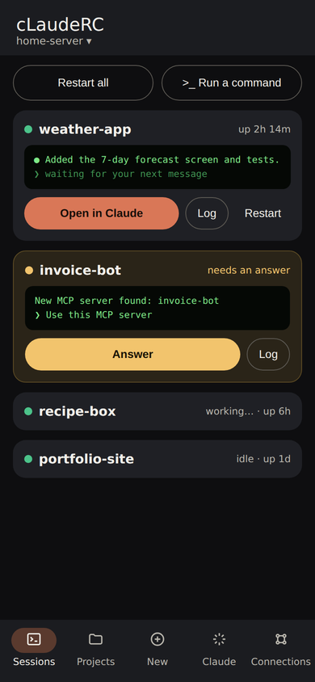</td>
<td>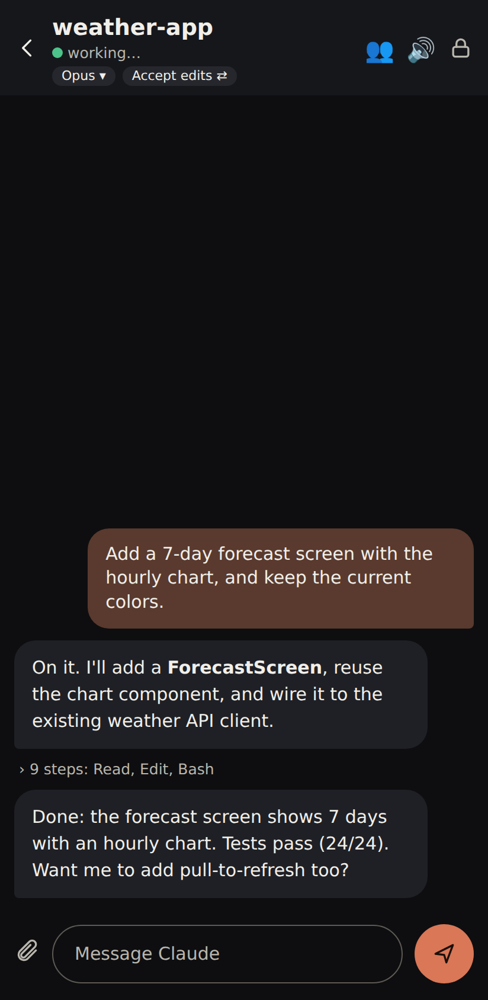</td>
<td>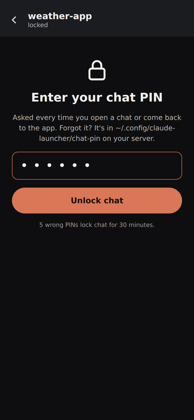</td>
<td>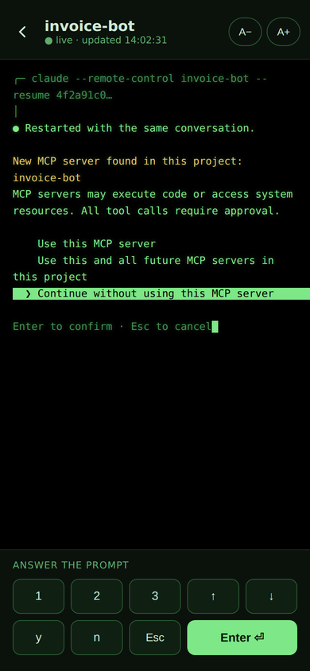</td>
</tr>
<tr>
<td align="center">Sessions</td><td align="center">Chat</td><td align="center">Chat PIN</td><td align="center">Session log</td>
</tr>
<tr>
<td>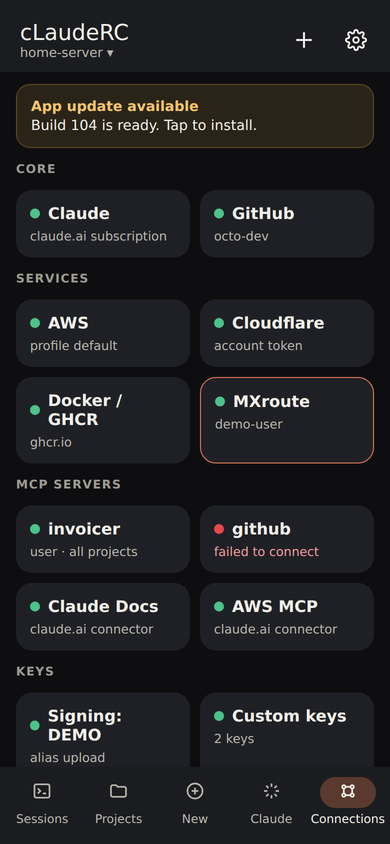</td>
<td>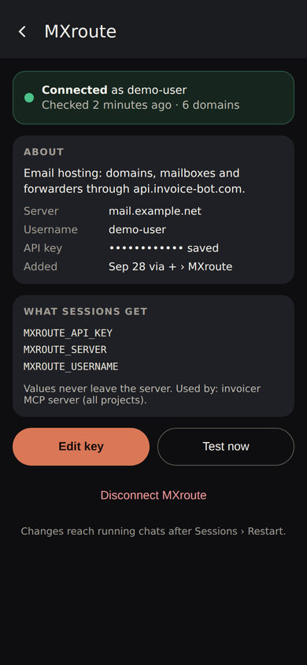</td>
<td>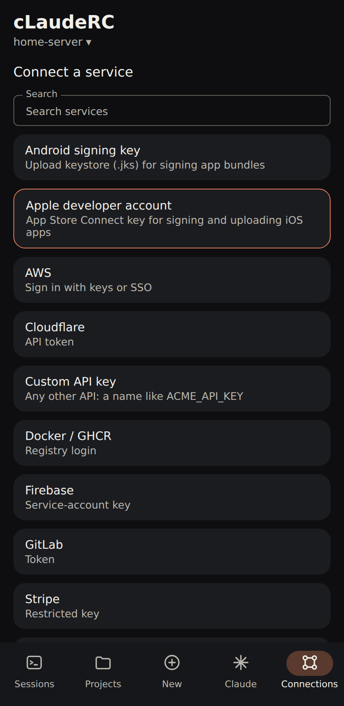</td>
<td>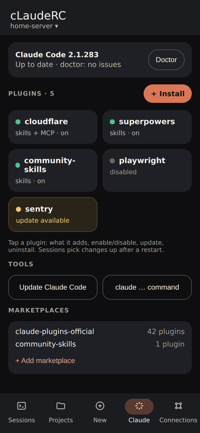</td>
</tr>
<tr>
<td align="center">Connections</td><td align="center">Details</td><td align="center">+ Connect a service</td><td align="center">Claude tab</td>
</tr>
<tr>
<td>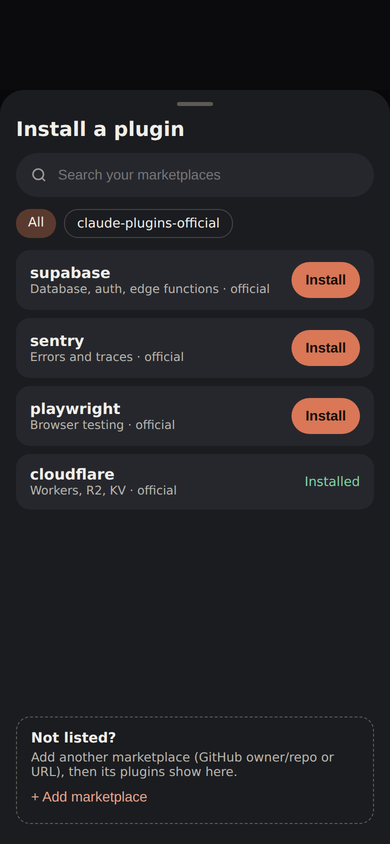</td>
<td>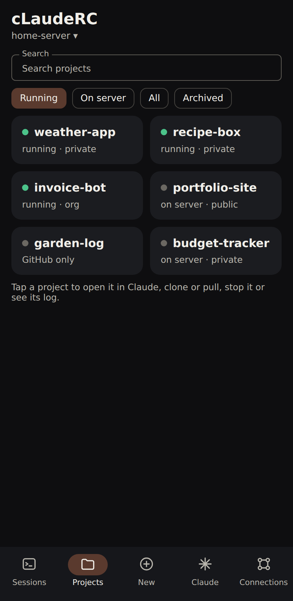</td>
<td>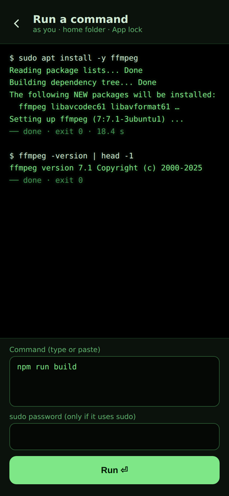</td>
<td>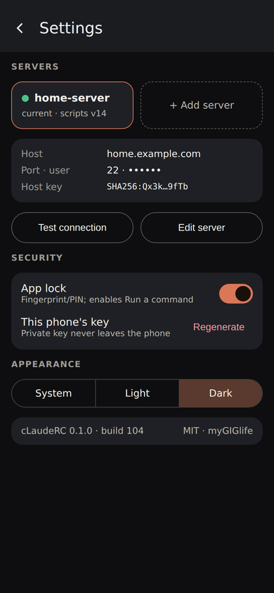</td>
</tr>
<tr>
<td align="center">Install a plugin</td><td align="center">Projects</td><td align="center">Run a command</td><td align="center">Settings</td>
</tr>
</table>

Screens shown with made-up example data (projects, accounts and hosts are not real).

## How it works

```
phone app ──SSH (its own Ed25519 key)──▶ sshd ──forced command──▶ claude-launcher-api
                                                                      │ allowlist + validation
                                                                      ▼
                                                     claude-setup.sh --api <action>  → one JSON object
```

Every call is short: connect, run one allowlisted action, read the JSON,
disconnect. The phone key can't open a shell, forward ports or run anything
off the allowlist (except **Run a command**, which is off unless you turn it on;
see Security). There is no web server, open port or cloud service.

## Screens

Five tabs, the same tile style throughout: **Sessions · Projects · New · Claude · Connections** (the app opens on Sessions; an update bar appears on top when a new build or server scripts are waiting).

| Tab | Shows | Actions |
| --- | --- | --- |
| **New** | Name (validated live), owner and visibility chips, “Start Claude now” | Create → repo link + **Open in Claude** |
| **Projects** | Your repos as tiles, newest first: running / on server / GitHub only, private/public, org | Chips: **Running** (default), **On server**, **All**, **Archived** (repos archived on GitHub, kept out of All); search; tap for Open in Claude, clone/pull + start, stop, log, GitHub, rename, make public/private, delete (type `delete` to confirm); long-press a running one for its log |
| **Sessions** | Each running Claude session with its last lines in green, busy/idle, and an amber **needs an answer** card when it's waiting on a question (e.g. approving a new MCP server) | **Chat** right in the app (behind a chat PIN: messages from Claude's own conversation, tool steps as short lines, tappable links, Claude's multiple-choice questions as tappable options, **Stop** while it works, a chip to switch model and one to cycle Claude's permission mode, 🎤 dictation (listens inside the app), a 🔊 switch that reads replies aloud (stays on until you turn it off) with Play/Pause under every reply, files Claude sends shown inline (image thumbnails, tap to zoom; **Save** for others), 📎 to send a file or photo into the project's `uploads/` folder; the same conversation as in the Claude app), **Open in Claude app** (menu), **Log** (a full-screen green-on-black terminal with A−/A+, live refresh and answer keys 1/2/3, ↑/↓, y/n, Esc, Enter), safe **Restart** / **Restart all** (reopens the same conversation, waits if Claude is busy), Stop; with App lock on, **Run a command** (terminal-style, type or paste, optional sudo password, keeps a scrollback of runs) |
| **Claude** | Claude Code's version, installed plugins as tiles (on / disabled), your marketplaces | **Doctor**, **Full checkup** (runs `/doctor` in its own session, shown in the chat), **Update Claude**; tap a plugin to enable, disable, update or uninstall it; **+ Install** searches every plugin across your marketplaces (with **Add marketplace** at the bottom for anything not listed); other allowed `claude` commands |
| **Connections** | Everything Claude on your server is connected to, as tiles in groups: **Core** (Claude, GitHub), **Services** (AWS, GitLab, Docker/GHCR, YouTube, Cloudflare, Vercel, MXroute, …), **MCP servers** (found automatically: your own, plugin ones and claude.ai connectors, with a live health dot, refreshed every 5 min) and **Keys** (signing keys, custom API keys). Server update card on top. | Tap a tile for its details: status, public info, the variable names sessions get (never values), **Edit** (new key), **Test now**, **Disconnect/Remove**. **+** (top right) connects a new service from a searchable A–Z list: AWS, GitLab, Docker/GHCR, Cloudflare, Vercel, Netlify, Fly.io, Railway, Supabase, Neon, npm, Stripe, Hugging Face, Backblaze B2, Google Cloud, Firebase, MXroute, Google Play Console, YouTube (with a `youtube-upload` command for every session), an **Android signing key**, or any **Custom API key**; it installs the CLI if needed, then asks for credentials. |

**Servers**: add as many as you like; tap the server name under the title to
switch. All of them use this phone's one key.

**Settings** (gear, behind App lock): session **notifications** (a session needs an answer or finished; off until you allow Android's notification permission), the **chat access log**, servers (add, switch, remove), host, port, username, pinned host key fingerprint, this phone's
key (regenerate, with two warnings, then the new install command), app lock (fingerprint/PIN before
create, stop, logins), theme.

## Install on the phone

1. Download the APK from [latest-main](https://github.com/myGIGlife-claude/Claude-RC/releases/tag/latest-main)
   (every push to `main`) or a tagged [Release](https://github.com/myGIGlife-claude/Claude-RC/releases)
   on the phone and install it (allow installs from your browser when asked).
2. Open **cLaudeRC**. The setup screen shows one command with this phone's key
   already in it. Tap **Copy command** (or **Share** to send it to your computer).
3. Run it in a terminal on the server, as the user Claude should run as:
   ```bash
   curl -fsSL https://raw.githubusercontent.com/myGIGlife-claude/Claude-RC/main/server/install.sh | bash -s -- 'ssh-ed25519 AAAA… clauderc'
   ```
   It downloads the server scripts (no clone), sets up `claude-autostart`
   (session restore after reboot; asks for sudo once), authorizes the phone,
   and prints the Host, Port, Username and host-key fingerprints.
   Needs `curl`, `jq`, `tmux`, `git`, `flock`. Run it again any time to update.
4. In the app enter Host, Port, Username → **Connect** → check the fingerprint
   is one the command printed → **Trust**.

Updates install over the old version because every build is signed with the
same key.

## Updates

The app checks GitHub when it opens and every hour while it's open. A new
app build shows a bar across the top of every tab with **Install** (it
downloads the APK and opens Android's installer; the APK is deleted once the
new build starts, so none pile up on the phone). With notifications on, you
also get one notification per new build. Newer server scripts show the same
bar (**View**) and a card on Connections with **Update now** (the server runs
that commit's `install.sh`, after you confirm) or **Copy command** to paste on
the server yourself. `install.sh` records the commit it installed so the app
can compare. The app tells you when the server scripts need an update.

## Security

- The app generates its own Ed25519 key; the private part is encrypted with an
  Android Keystore AES-GCM key and never leaves the phone or its backups.
- The server pins that key to `claude-launcher-api` with `restrict` (no pty, no
  forwarding of any kind), so the key can only run that one program.
- **Run a command** is the one exception: it runs what you type as your user
  (and sudo with the password you enter). It only exists when App lock is on
  in the app **and** the server's config has `ALLOW_RUN=1`, so a lost phone
  can't enable it. Each run asks for your fingerprint/PIN. The sudo password
  reaches sudo through a private askpass file, never a command line or log.
- App lock is required: fingerprint, face or screen lock to open the app and
  again after 30 s in the background, and to open Settings (servers, this
  phone's key) and Run a command; it also hides the app from the Recents
  screen. Everyday actions (start, stop, restart, create, install, connect)
  don't ask again: they're what the Claude app itself does.
- In-app chat needs a second secret, a chat PIN (6–12 digits), asked when
  a chat opens and again after any trip away from the app, unless you chose
  "don't ask again" for 30 min / 1 h / 4 h. It exists only in
  `~/.config/claude-launcher/chat-pin` (mode 600) on the server, which is how
  you recover it; no action returns it and the app never stores it. Every chat
  call carries it and the server checks it; 5 wrong PINs lock chat for 30
  minutes (or until you delete `~/.config/claude-launcher/chat-locked`). Chat
  opens and sends are logged (without contents) in
  `~/.local/state/claude-launcher/chat.log`.
- The runner never uses `eval` or a shell on the request string; it only
  accepts known subcommands with validated arguments.
- Host key is pinned on first connect after you compare the fingerprint; a
  changed key is refused.
- Tokens, codes and AWS keys travel on stdin only, never on a command line, and
  the audit log records only time, action and result code.
- Service tokens (Cloudflare, Vercel, …) are checked with the provider, then
  kept in `~/.config/claude-launcher/env` (mode 600); JSON keys in mode-600
  files next to it. They reach Claude's sessions (commands and MCP servers)
  through the `env` block of `~/.claude/settings.json`, which is kept mode 600.
- Nothing personal is in this repo: server details live in the app's settings
  and in `~/.config/claude-launcher/config` on the server.

Found a security problem? Please open a
[private security advisory](https://github.com/myGIGlife-claude/Claude-RC/security/advisories/new)
instead of a public issue.

## Building

CI (`.github/workflows/build.yml`) runs gitleaks over the full history, the
server tests (including a real sshd), unit tests, and builds a signed release
APK. Tags `v*` publish a GitHub Release; pushes to `main` update the
`latest-main` pre-release.

Signing: releases are signed with the project's private key (from the
repository secrets) and CI fails any APK with a different certificate. Only
install APKs from this repo's Releases. Builds from pull requests or your own
machine use the public `app/debug.keystore`, are for testing only, and can't
update a release install. Forks: set the four `SIGNING_*` secrets to your own
key and change `EXPECTED_CERT_SHA256` in the workflow.

Locally:

```bash
./gradlew assembleDebug
./gradlew assembleRelease   # signed with the public debug key unless keystore.properties points at yours
```

## Contributing

Issues and pull requests are welcome. CI must pass: gitleaks, shellcheck, the
server tests (`server/tests/test-api.sh`, `server/tests/test-sshd.sh`) and the
Android build. Keep personal values (hosts, usernames, emails, keys) out of
code, docs and commits.

## License and credit

[MIT](LICENSE) © 2026 myGIGlife. Free to use, change, share and build on,
including commercially. The one condition: keep the copyright notice and the
license text in copies and forks, so the original project is credited.

If cLaudeRC helps you or you build on it, a link back to
<https://github.com/myGIGlife-claude/Claude-RC> is appreciated.
